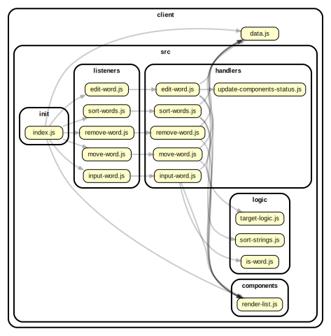

<!-- BEGIN TITLE -->

# DOCS

<!-- END TITLE -->

<!-- BEGIN TREE -->

> [interactive graph](./dependency-graph.html)



<!-- END TREE -->

<!-- BEGIN TOC -->

- public
- src
  - components
    - [render-list.js](#clientsrccomponentsrender-listjs)
  - handlers
    - [edit-word.js](#clientsrchandlersedit-wordjs)
    - [input-word.js](#clientsrchandlersinput-wordjs)
    - [move-word.js](#clientsrchandlersmove-wordjs)
    - [remove-word.js](#clientsrchandlersremove-wordjs)
    - [sort-words.js](#clientsrchandlerssort-wordsjs)
    - [update-components-status.js](#clientsrchandlersupdate-components-statusjs)
  - init
    - [index.js](#clientsrcinitindexjs)
  - listeners
    - [edit-word.js](#clientsrclistenersedit-wordjs)
    - [input-word.js](#clientsrclistenersinput-wordjs)
    - [move-word.js](#clientsrclistenersmove-wordjs)
    - [remove-word.js](#clientsrclistenersremove-wordjs)
    - [sort-words.js](#clientsrclistenerssort-wordsjs)
  - logic
    - [is-word.js](#clientsrclogicis-wordjs)
    - [sort-strings.js](#clientsrclogicsort-stringsjs)
    - [target-logic.js](#clientsrclogictarget-logicjs)
- styles
- [data.js](#clientdatajs)

---

<!-- END TOC -->

<!-- BEGIN DOCS -->

# /public

---

# /src

## /components

<details><summary><a href="../../client/src/components/render-list.js" id="clientsrccomponentsrender-listjs">../client/src/components/render-list.js</a></summary>

## Constants

<dl>
<dt><a href="#renderList">renderList</a></dt>
<dd><p>Render components to UI.</p>
</dd>
</dl>

## Functions

<dl>
<dt><a href="#renderListNew">renderListNew([data])</a></dt>
<dd><p>Render components of the New table on the UI.</p>
</dd>
<dt><a href="#renderListRem">renderListRem([data])</a></dt>
<dd><p>Render components of the Rem table on the UI.</p>
</dd>
</dl>

<a name="renderList"></a>

## renderList

Render components to UI.

| Param          | Type                | Default                               | Description                                                        |
| -------------- | ------------------- | ------------------------------------- | ------------------------------------------------------------------ |
| [data]         | <code>object</code> | <code>{}</code>                       | An object which contain word lists, sort type and other variables. |
| [listToRender] | <code>string</code> | <code>&quot;&#x27;&#x27;&quot;</code> | A string indicates which table(s) to render.                       |

<a name="renderListNew"></a>

## renderListNew([data])

Render components of the New table on the UI.

| Param  | Type                | Default         | Description                                                        |
| ------ | ------------------- | --------------- | ------------------------------------------------------------------ |
| [data] | <code>object</code> | <code>{}</code> | An object which contain word lists, sort type and other variables. |

<a name="renderListRem"></a>

## renderListRem([data])

Render components of the Rem table on the UI.

| Param  | Type                | Default         | Description                                                        |
| ------ | ------------------- | --------------- | ------------------------------------------------------------------ |
| [data] | <code>object</code> | <code>{}</code> | An object which contain word lists, sort type and other variables. |

</details>

---

## /handlers

<details><summary><a href="../../client/src/handlers/edit-word.js" id="clientsrchandlersedit-wordjs">../client/src/handlers/edit-word.js</a></summary>

## Constants

<dl>
<dt><a href="#editItemHandler">editItemHandler</a></dt>
<dd><p>Entry point for users edit a word on the list.
It is called each time the user clicks the &quot;pen&quot; button.</p>
</dd>
<dt><a href="#confirmEditWithEnterHandler">confirmEditWithEnterHandler</a></dt>
<dd><p>Entry point for users confirm edits on the list.
It is called each time the user press Enter key on label element.</p>
</dd>
</dl>

## Functions

<dl>
<dt><a href="#editItemHandlerNew">editItemHandlerNew(event)</a></dt>
<dd><p>Utility function of the handler of below event.
The user clicks the &quot;pen&quot; button.</p>
</dd>
<dt><a href="#editItemHandlerRem">editItemHandlerRem(event)</a></dt>
<dd><p>Utility function of the handler of below event.
The user clicks the &quot;pen&quot; button.</p>
</dd>
<dt><a href="#confirmEditWithEnterHandlerNew">confirmEditWithEnterHandlerNew(event)</a></dt>
<dd><p>Utility function of the handler of below event.
The user press Enter key on input element.</p>
</dd>
<dt><a href="#confirmEditWithEnterHandlerRem">confirmEditWithEnterHandlerRem(event)</a></dt>
<dd><p>Utility function of the handler of below event.
The user press Enter key on input element.</p>
</dd>
</dl>

<a name="editItemHandler"></a>

## editItemHandler

Entry point for users edit a word on the list.
It is called each time the user clicks the "pen" button.

| Param | Type               | Description                                          |
| ----- | ------------------ | ---------------------------------------------------- |
| event | <code>Event</code> | The event triggered when the user clicks the button. |

<a name="confirmEditWithEnterHandler"></a>

## confirmEditWithEnterHandler

Entry point for users confirm edits on the list.
It is called each time the user press Enter key on label element.

| Param | Type               | Description                                                         |
| ----- | ------------------ | ------------------------------------------------------------------- |
| event | <code>Event</code> | The event triggered when the user press Enter key on label element. |

<a name="editItemHandlerNew"></a>

## editItemHandlerNew(event)

Utility function of the handler of below event.
The user clicks the "pen" button.

| Param | Type               | Description                                          |
| ----- | ------------------ | ---------------------------------------------------- |
| event | <code>Event</code> | The event triggered when the user clicks the button. |

<a name="editItemHandlerRem"></a>

## editItemHandlerRem(event)

Utility function of the handler of below event.
The user clicks the "pen" button.

| Param | Type               | Description                                          |
| ----- | ------------------ | ---------------------------------------------------- |
| event | <code>Event</code> | The event triggered when the user clicks the button. |

<a name="confirmEditWithEnterHandlerNew"></a>

## confirmEditWithEnterHandlerNew(event)

Utility function of the handler of below event.
The user press Enter key on input element.

| Param | Type               | Description                                                         |
| ----- | ------------------ | ------------------------------------------------------------------- |
| event | <code>Event</code> | The event triggered when the user press Enter key on input element. |

<a name="confirmEditWithEnterHandlerRem"></a>

## confirmEditWithEnterHandlerRem(event)

Utility function of the handler of below event.
The user press Enter key on input element.

| Param | Type               | Description                                                         |
| ----- | ------------------ | ------------------------------------------------------------------- |
| event | <code>Event</code> | The event triggered when the user press Enter key on input element. |

</details>

<details><summary><a href="../../client/src/handlers/input-word.js" id="clientsrchandlersinput-wordjs">../client/src/handlers/input-word.js</a></summary>

## Constants

<dl>
<dt><a href="#inputWordHandler">inputWordHandler</a></dt>
<dd><p>Entry point for users adding a word to the list.
It is called each time the user clicks the &quot;add word&quot; button.</p>
</dd>
<dt><a href="#getInputWithEnterHandler">getInputWithEnterHandler</a></dt>
<dd><p>Entry point for users add word to list.
It is called each time the user press the &quot;Enter&quot; key.</p>
</dd>
</dl>

<a name="inputWordHandler"></a>

## inputWordHandler

Entry point for users adding a word to the list.
It is called each time the user clicks the "add word" button.

| Param | Type               | Description                                          |
| ----- | ------------------ | ---------------------------------------------------- |
| event | <code>Event</code> | The event triggered when the user clicks the button. |

<a name="getInputWithEnterHandler"></a>

## getInputWithEnterHandler

Entry point for users add word to list.
It is called each time the user press the "Enter" key.

| Param | Type               | Description                                     |
| ----- | ------------------ | ----------------------------------------------- |
| event | <code>Event</code> | The event triggered when press the "Enter" key. |

</details>

<details><summary><a href="../../client/src/handlers/move-word.js" id="clientsrchandlersmove-wordjs">../client/src/handlers/move-word.js</a></summary>

<a name="moveItemHandler"></a>

## moveItemHandler

Entry point for users move words between the lists.
It is called each time the user clicks the "to remembered" or "to new" button.

| Param | Type               | Description                                          |
| ----- | ------------------ | ---------------------------------------------------- |
| event | <code>Event</code> | The event triggered when the user clicks the button. |

</details>

<details><summary><a href="../../client/src/handlers/remove-word.js" id="clientsrchandlersremove-wordjs">../client/src/handlers/remove-word.js</a></summary>

<a name="removeWordHandler"></a>

## removeWordHandler

Entry point for users remove a word from the list.
It is called each time the user clicks the "trash can" button.

| Param | Type               | Description                                          |
| ----- | ------------------ | ---------------------------------------------------- |
| event | <code>Event</code> | The event triggered when the user clicks the button. |

</details>

<details><summary><a href="../../client/src/handlers/sort-words.js" id="clientsrchandlerssort-wordsjs">../client/src/handlers/sort-words.js</a></summary>

<a name="sortWordsHandler"></a>

## sortWordsHandler

Entry point for users sorting the list of words in this app.
It is called each time the input selection changes.

| Param | Type               | Description                                |
| ----- | ------------------ | ------------------------------------------ |
| event | <code>Event</code> | The event triggered by changing the input. |

</details>

<details><summary><a href="../../client/src/handlers/update-components-status.js" id="clientsrchandlersupdate-components-statusjs">../client/src/handlers/update-components-status.js</a></summary>

<a name="updateComponentsState"></a>

## updateComponentsState

Update the state of buttons and select on the UI.

| Param  | Type                | Default         | Description                                             |
| ------ | ------------------- | --------------- | ------------------------------------------------------- |
| [data] | <code>object</code> | <code>{}</code> | An object which contain two word lists and a sort type. |

</details>

---

## /init

<details><summary><a href="../../client/src/init/index.js" id="clientsrcinitindexjs">../client/src/init/index.js</a></summary>

</details>

---

## /listeners

<details><summary><a href="../../client/src/listeners/edit-word.js" id="clientsrclistenersedit-wordjs">../client/src/listeners/edit-word.js</a></summary>

</details>

<details><summary><a href="../../client/src/listeners/input-word.js" id="clientsrclistenersinput-wordjs">../client/src/listeners/input-word.js</a></summary>

</details>

<details><summary><a href="../../client/src/listeners/move-word.js" id="clientsrclistenersmove-wordjs">../client/src/listeners/move-word.js</a></summary>

</details>

<details><summary><a href="../../client/src/listeners/remove-word.js" id="clientsrclistenersremove-wordjs">../client/src/listeners/remove-word.js</a></summary>

</details>

<details><summary><a href="../../client/src/listeners/sort-words.js" id="clientsrclistenerssort-wordsjs">../client/src/listeners/sort-words.js</a></summary>

</details>

---

## /logic

<details><summary><a href="../../client/src/logic/is-word.js" id="clientsrclogicis-wordjs">../client/src/logic/is-word.js</a></summary>

<a name="isWord"></a>

## isWord ⇒ <code>boolean</code>

Checks if a string is a word. A word contains only letters.

**Returns**: <code>boolean</code> - Whether or not the text is a word.

| Param | Type                | Description                      |
| ----- | ------------------- | -------------------------------- |
| text  | <code>string</code> | A string to check for wordiness. |

**Example**

```js
isWord('hello') -> true
isWord('1ab') -> false
isWord('spell-check') -> false
```

</details>

<details><summary><a href="../../client/src/logic/sort-strings.js" id="clientsrclogicsort-stringsjs">../client/src/logic/sort-strings.js</a></summary>

<a name="sortStrings"></a>

## sortStrings ⇒ <code>Array.&lt;Array&gt;</code>

Sorts an array of strings in different ways.
It does not modify the argument (no side-effects).

**Returns**: <code>Array.&lt;Array&gt;</code> - A new sorted array containing the same strings as toSort.

| Param      | Type                             | Default                                     | Description                                                                                                                                                                                                                                                                                                             |
| ---------- | -------------------------------- | ------------------------------------------- | ----------------------------------------------------------------------------------------------------------------------------------------------------------------------------------------------------------------------------------------------------------------------------------------------------------------------- |
| [toSort]   | <code>Array.&lt;Array&gt;</code> | <code>[]</code>                             | The array of strings to sort.                                                                                                                                                                                                                                                                                           |
| [sortType] | <code>string</code>              | <code>&quot;&#x27;oldest&#x27;&quot;</code> | How to sort the strings, 6 options. - oldest: from oldest to newest. - newest: from newest to oldest. - shortest: from shortest to longest. - longest: from longest to shortest. - a: alphabetical order. - z: reverse alphabetical order. If the sortType is not one of these 6 options, a copy of toSort is returned. |

**Example**

```js
sortStrings = (["ab", "abc", "hello"], sortType = 'oldest') -> ["ab", "abc", "hello"]
sortStrings = (["ab", "abc", "hello"], sortType = 'longest') -> ["hello", "abc","ab"]
```

</details>

<details><summary><a href="../../client/src/logic/target-logic.js" id="clientsrclogictarget-logicjs">../client/src/logic/target-logic.js</a></summary>

## Constants

<dl>
<dt><a href="#targetAtNewPen">targetAtNewPen</a> ⇒ <code>boolean</code></dt>
<dd><p>Target logic: which component the event targets at.</p>
</dd>
<dt><a href="#targetAtRemPen">targetAtRemPen</a> ⇒ <code>boolean</code></dt>
<dd><p>Target logic: which component the event targets at.</p>
</dd>
<dt><a href="#targetAtNewList">targetAtNewList</a> ⇒ <code>boolean</code></dt>
<dd><p>Target logic: which component the event targets at.</p>
</dd>
<dt><a href="#targetAtRemList">targetAtRemList</a> ⇒ <code>boolean</code></dt>
<dd><p>Target logic: which component the event targets at.</p>
</dd>
</dl>

<a name="targetAtNewPen"></a>

## targetAtNewPen ⇒ <code>boolean</code>

Target logic: which component the event targets at.

**Returns**: <code>boolean</code> - .

| Param | Type                | Description             |
| ----- | ------------------- | ----------------------- |
| t     | <code>object</code> | The target of an event. |

<a name="targetAtRemPen"></a>

## targetAtRemPen ⇒ <code>boolean</code>

Target logic: which component the event targets at.

**Returns**: <code>boolean</code> - .

| Param | Type                | Description             |
| ----- | ------------------- | ----------------------- |
| t     | <code>object</code> | The target of an event. |

<a name="targetAtNewList"></a>

## targetAtNewList ⇒ <code>boolean</code>

Target logic: which component the event targets at.

**Returns**: <code>boolean</code> - .

| Param | Type                | Description             |
| ----- | ------------------- | ----------------------- |
| t     | <code>object</code> | The target of an event. |

<a name="targetAtRemList"></a>

## targetAtRemList ⇒ <code>boolean</code>

Target logic: which component the event targets at.

**Returns**: <code>boolean</code> - .

| Param | Type                | Description             |
| ----- | ------------------- | ----------------------- |
| t     | <code>object</code> | The target of an event. |

</details>

---

---

# /styles

---

<details><summary><a href="../../client/data.js" id="clientdatajs">../client/data.js</a></summary>

<a name="data"></a>

## data

**Properties**

| Name            | Type                              | Description                                                         |
| --------------- | --------------------------------- | ------------------------------------------------------------------- |
| newWords        | <code>Array.&lt;string&gt;</code> | An array of words that the user has provided.                       |
| rememberedWords | <code>Array.&lt;string&gt;</code> | An array of words that the user has moved from new words list.      |
| sort            | <code>string</code>               | A string indicating the order string should be displayed in the UI. |

</details>

<!-- END DOCS -->
